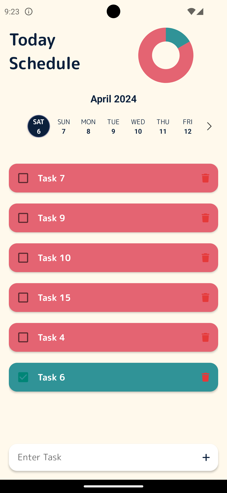
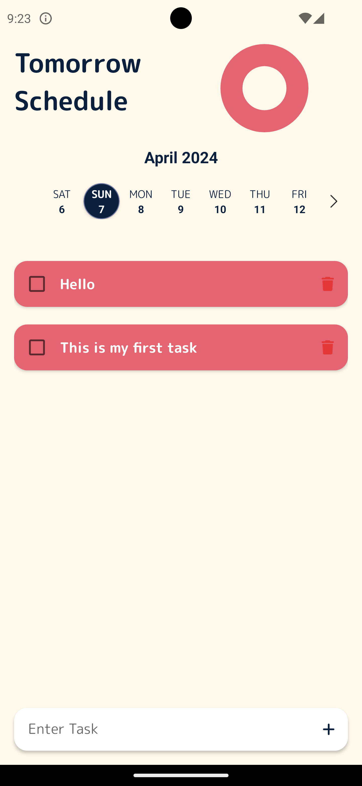
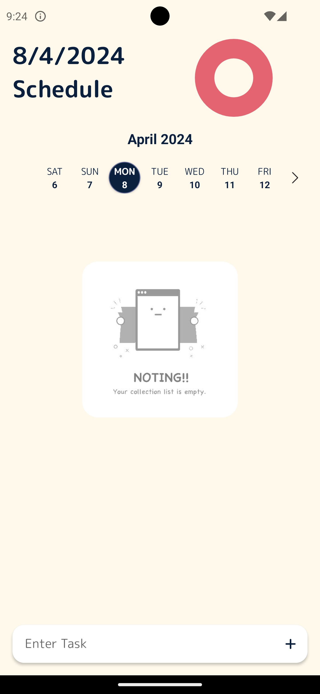
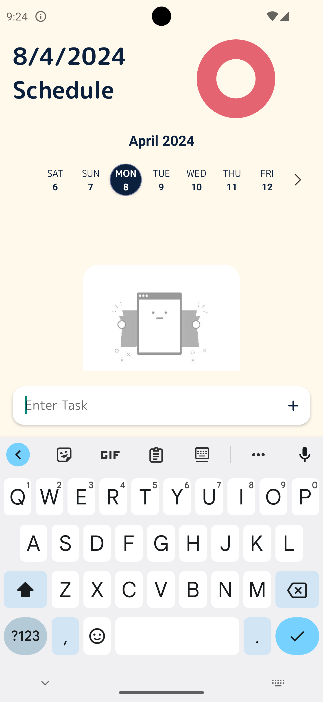

# Todo Minimal

"TodoMinimal" likely refers to a minimalist approach or design philosophy applied to a to-do list or task management system. In this context, TodoMinimal would aim to provide a simple and streamlined user experience, focusing on essential features without unnecessary complexity or clutter. The goal is to help users efficiently organize and manage their tasks with a clean and minimalist design.

## Key Third-Party Library Use in the App

- "react-native-calendar-strip": "^2.2.6"
- "react-native-check-box": "^2.1.7"
- "react-native-pie-chart": "^3.0.2"
- "react-redux": "^9.0.4"
- "redux": "^5.0.1"
- "redux-persist": "^6.0.0"
- "redux-toolkit": "^1.1.2"

## Screenshots

## Author

This is a sample application for practicing some libraries and showcasing my development skills, here I use the rich library listed above.

## Contributing

Pull requests are welcome. For major changes, please open an issue first
to discuss what you would like to change.

Please make sure to update tests as appropriate.

## License

[MIT](https://choosealicense.com/licenses/mit/)
